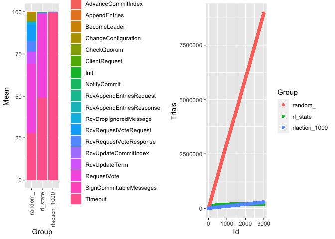

PageQueue
================
Markus A Kuppe
(2022-12-23)

- <a href="#tla-specification" id="toc-tla-specification">TLA+
  specification</a>
  - <a href="#reinforcement-learning---q-learning"
    id="toc-reinforcement-learning---q-learning">Reinforcement Learning -
    Q-Learning</a>

# TLA+ specification

This directory contains a formal specification of CCF’s variant of Raft
in TLA+. For more information, please refer to the CCF documentation:
<https://microsoft.github.io/CCF/main/architecture/raft_tla.html>.

You can also interact with this specification using codespaces:

[](https://github.com/codespaces/new?hide_repo_select=true&ref=main&repo=180112558&machine=xLargePremiumLinux&devcontainer_path=.devcontainer%2Ftlaplus%2Fdevcontainer.json&location=WestEurope)

You can also manually run [install_deps.py](install_deps.py) to install
or update the dependencies required to interact with the spec. Run with
`--help` to see all available options

## Reinforcement Learning - Q-Learning

### Data Collection

``` shell
conf="" tlcdev $TLC_OPTS -note -simulate num=3000 RLCoverageccfraft

conf="state" TLC_OPTS="-Dtlc2.tool.Simulator.rl.reward=1000" tlcdev $TLC_OPTS -note -simulate sched=rl,num=3000 RLCoverageccfraft

conf="Rangestate" TLC_OPTS="-Dtlc2.tool.Simulator.rl.reward=1000" tlcdev $TLC_OPTS -note -simulate sched=rl,num=3000 RLCoverageccfraft

conf="1000" TLC_OPTS="-Dtlc2.tool.Simulator.rl.reward=1000" tlcdev $TLC_OPTS -note -simulate sched=rlaction,num=3000 RLCoverageccfraft
```

The first plot shows the average (mean) number of `A`-steps per trace
with `A` a sub-action of the next-state relation. The second plots show
the number of times (`trials`) over time (x-axis) the TLC’s simualtor
samples sub-actions to generate one of more successor states. The plot
indicates if reinforcement learning (RL) learned action enablement.

- random: TLC’s simulator samples sub-actions uniformly at random.
- rl: TLC’s simulator samples sub-actions according to the Q-Learning
  algorithm in [“Learning-based Controlled Concurrency
  Testing”](https://www.microsoft.com/en-us/research/publication/learning-based-controlled-concurrency-testing/).
  The Q-Learning hash `H` is calculated from the spec’s `state` variable
  of the current state. The Q-Learning state-space is `A x H`, where `A`
  is the set of sub-actions of the next-state relation and `H` is the
  set of TLA+ fingerprints.
- rlaction: TLC’s simulator samples sub-actions according to the Q-table
  and the (Java) hashCode value of the current action. In other words,
  the TLA+ states are excluded from Q-Learning. The Q-Learning
  state-space is `A x A`, where `A` is the set of sub-actions of the
  next-state relation.

<!-- -->

### Results

- It is an open problem what spec variables to include in the RL hash
  function `H`. Our choice of `Range(state)` and `state` appears to be
  sub-optimal, although it is not clear why.
- Learning action enablement appears to learn that the `Timeout` action
  is almost always enabled (there is usually a `Follower` or
  `Candidate`). This reduces the number of trials while negatively
  impacting coverage.
- Using human insight to manually bias random exploration by reducing
  the probability of failure actions (see SIMCoverageccfraft) provides a
  far superior coverage.

Note that wallclock time of random exploration is much lower than for
RL. Optimizations such as caching the TLA+ fingerprints are possible,
but not implemented yet.

### Next steps

- Investing time on finding the inductive invariant paired with its
  (probabilistic)
  [validation](https://lamport.azurewebsites.net/tla/inductive-invariant.pdf)
  might yield more promising results.
  - The [existing TLA+ raft proof
    sketch](https://github.com/dricketts/raft.tla/blob/master/raft.tla)
    could inspire the search for an inductive invariant.
- Implement a PCT scheduler as per [“A Randomized Scheduler with
  Probabilistic Guarantees of Finding
  Bugs”](https://www.microsoft.com/en-us/research/wp-content/uploads/2016/02/asplos277-pct.pdf)
  and its [implementation in
  Coyote](https://github.com/microsoft/coyote/blob/main/Source/Core/Testing/Interleaving/PrioritizationStrategy.cs).
  - The PCT scheduler could be combined with RL-based techniques.

#### README.md is generated from README.Rmd on a host with all libraries installed via:

``` shell
Rscript -e "rmarkdown::render('README.Rmd')"
```

### Install required libraries and R packages (on macOS) with:

``` shell
brew install pandoc r
Rscript -e "install.packages(c('rmarkdown', 'ggplot2','dplyr', 'here'), repos='http://cran.us.r-project.org')"
```
